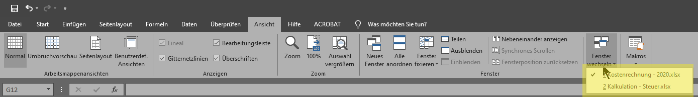
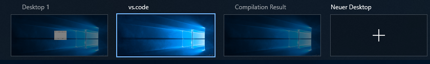
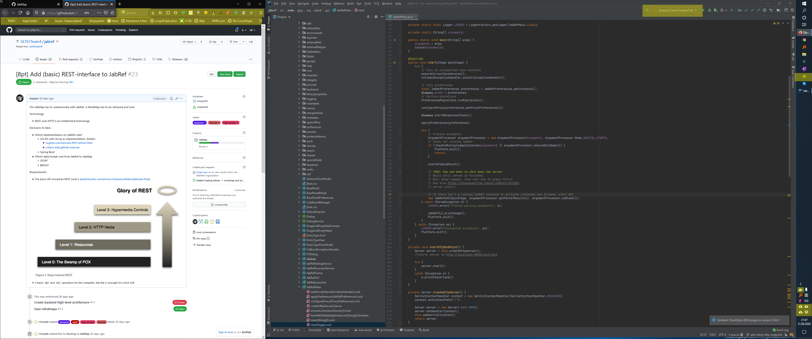
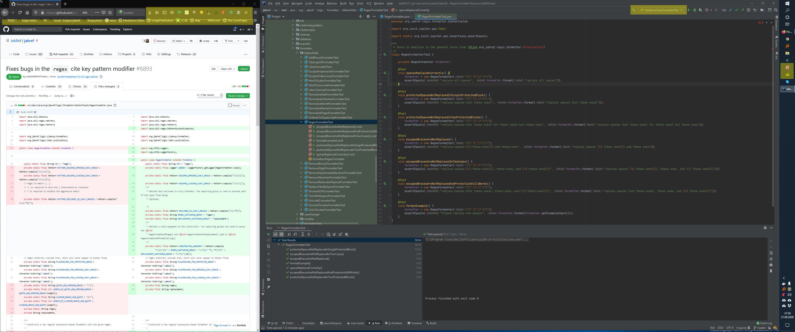

# ContextSwitcher

> ContextSwitcher is [Mylyn](https://www.eclipse.org/mylyn/) for the Windows desktop.

**Call for student development** In relation to [ICSE 2021](https://conf.researchr.org/home/icse-2021) in the context of [SCORE 2021](https://conf.researchr.org/home/icse-2021/score-2021) --> <https://conf.researchr.org/home/icse-2021/score-2021#contextswitcher-focus-on-the-thing-to-be-done>

## Motivation

The target group are persons working on multiple projects.
One project may be "buy Acme Brick Co.".
Most people have between 30 and 100 of these [says David Allen](https://gettingthingsdone.com/2011/01/the-6-horizons-of-focus/).

Context switcher allows for switchting between projects.

Suppose you are working on a project.
You have opened IntelliJ, some browser tabs, and a Word document.
Now, an urgent email comes in.
This requires you to switch the context to another project.
When you left that project, you had different browser windows and different Word documents opened.
ContextSwitcher restores these at a finger type.

More simpler: ContextSwitcher is a workspace manager across multiple applications.

## Example Projects, Tasks and Opened Applications

A project might be subdivided into several tasks. These examples show a current task of a project.

* Project "Holiday 2025": Task: “Search for city tours in Leipzig”: Chrome and OneNote (for taking notes)
* Project "Research Agenda 2025": Task: “Collection information about a topic”: Chrome and JabRef (for storing the bibliography entries)
* Project "Student Project: Implement Software X": “Meeting with students about their project”: Outlook (with all relevant emails), Notepad++ (for meeting minutes), Explorer (showing the project directory), Eclipse (with the current workspace and the linked Mylyn task being active)
* Project "Be MSc in 2021": Task: "Write thesis": Working on a large LaTeX document

In each opened application, only the relevant files (tabs) should be opened.
When switching a project, the already opened applications should be left opened, not required should be closed and new ones have to be opened.
The same applies to files (tabs) in the applications.
If possible, the last focused position (line in Word documents, cell in Excel, slide in PowerPoint) should be restored.

## Comparison to Virtual Desktops

Users use virtual desktops in two ways:

* Each virtual desktop for a context
* Multiple desktops for a single context

When using each virtual desktop for a context, the first context might be "email reading and surfing" and the next one "coding".
For "Thesis writing", a third desktop "LaTeX" needs to be opened.
Thus, one needs n different desktops for n projects.
Alternatively, virutal desktops need to be resued and maybe won't be named properly (e.g., "LaTeX" versus "Desktop 2").

When using multipe desktops for a single context, the current context might be "coding" with the virtual desktops "email reading and surfing" and "coding". When switching to the context "Thesis writing", browser tabs need to be closed and new ones opened, JabRef will be loaded, the "coding" desktop will be renamed to "LaTeX" (containing TeXstudio).

Not all applications fully support Virtual Desktop.
For instance, Microsoft Excel shows opened windows on *all* virtual desktops:



For Skype, when focusing the application on a virutal desktop, the skype app steals the focus on its current virutal desktop.

When working on **one** project, possibly, **multiple** virtual desktops are required.
Currently, they have to be renamed for each project manually.

In the following example, they are named "Desktop 1", "vs.code", and "Compilation Result".
The first one is intended for a web browser, the second one for Visual Studio Code, and the final one holds some LaTeX compilation result.
These desktops are required in the latex-template context only, not in a context for searching for a trip, for instance.



## Application Limitations

* Microsoft Office applications show all opened windows in the "Window" drop down. ContextSwitcher will display only relevent Windows for the task (because only these documents are opened)
* Skype cannot be opened in multipe virtual desktops

### Unnecessary Icons and IDE Details



The yellow-marked things in the tools are either obsolete in this context (firefox, icons in the task bar) - or wrong (IntelliJ - I don't need this run thing).

### Cross-Application Context Switching Not Working

When reviewing a pull request on GitHub, the IDE should checkout the code and switch to the branch. This doesn't happen.



## Background and Related Work

When working with code in Eclipse, one has opened many files by the time.
Often, not all opened files are required for a specific project.
Moreover, when looking deeper into a project, there are different "tasks" to do.
Currently, such tasks are called "issues".
See the GitHub guidelines on issues for more information on issues: <https://guides.github.com/features/issues>.

### Windows

* Windows Timline. See <https://winaero.com/blog/enable-use-timeline-windows-10/>, <https://www.digitaltrends.com/computing/how-to-use-windows-timeline/>, <http://winfuture.de/videos/Software/Windows-Timeline-So-funktioniert-die-Zeitleiste-von-Windows-10-18708.html>, and [Windows Timeline Introduction Video](https://youtu.be/jV09HpVj4gg?t=123)
* [Windows 10 Sets](https://insider.windows.com/de-de/articles/introducing-sets/).
  [Sundown in April 2019](https://www.heise.de/newsticker/meldung/Bedienkonzept-Microsoft-beerdigt-Sets-fuer-Windows-10-4404211.html).
* [bug.n](https://github.com/fuhsjr00/bug.n) - can provide views on opened windows.
* [Workspacer](https://github.com/rickbutton/workspacer) - tiling Window management on Windows - with multiple desktops.

### Mac OS X

* [Switch](https://github.com/numist/Switch)

### Linux

* [Plasma Activities](https://wiki.ubuntuusers.de/Plasma/Aktivit%C3%A4ten/)

### Browser

* Light Table as new IDE concept: <http://www.chris-granger.com/2012/04/12/light-table-a-new-ide-concept/>
* [ZenHub's Workspaces](https://help.zenhub.com/support/solutions/articles/43000495219). This concept is bound to GitHub.
* Firefox supportorts [profiles](https://developer.mozilla.org/en-US/docs/Mozilla/Firefox/Multiple_profiles) where seperate Firefox configurations could be done (e.g., family or work).
  However, it requires much effort to create a Firefox profile for each context

### Special Features

* IntelliJ 2017.3 restores the current editors when changing branches in git.
  See <https://blog.jetbrains.com/idea/2017/10/intellij-idea-2017-3-vcs-enhancements-and-more/>.

  > IntelliJ IDEA saves your context (a set of opened files, the current run configuration, and breakpoints) provided that the Restore workspace on branch switching option is enabled in the Settings/Preferences dialog Ctrl+Alt+S under Version Control | Confirmation. When you switch to a branch, IntelliJ IDEA automatically restores your context associated with that branch.
  
* The [Bento Browser](https://bentobrowser.com/) by the [Carnegie Mellon Human Computer Interaction Institute](https://hcii.cmu.edu/) groups browser tabs into projects.
* [Marketer Browser](https://www.marketerbrowser.com/) supports multiple accounts for the same web page
  * Similar to [Session Box](https://sessionbox.io/)
  * Similar to [BiscuitBrowser](https://eatbiscuit.com/)
* [Workona](https://workona.com/) - workspaces in the browser
* Chrome Plugin [Simple Window Saver](https://chrome.google.com/webstore/detail/simple-window-saver/fpfmklldfnlcblofkhdeoohfppdoejdc)

  > Simple Window Saver makes it super easy to save and restore windows. Keep one window for work tabs, one for Gmail and Facebook, and one for your vacation planning or the research on that new TV you want to buy.

### Concept of "Task-Focused Interface"

The concept of a “[task-focused interface](https://en.wikipedia.org/wiki/Task-focused_interface)” has been invented and turned into software as Eclipse [Mylyn](https://www.eclipse.org/mylyn/).
It answers following questions:
What if only the relevant files are opened and even the most touched lines are highlighted?
What if one can give a colleague a reference to the current state of the IDE to enable a simpler reproduction of an issue?
One can read more about Mylyn at the [Mylyn Tutorial](https://web.archive.org/web/20170929190100/http://www.tasktop.com/mylyn/tutorial).
Concerning the availability of the task-focused interface across multiple applications, the [Tasktop Dev Standalone Application](http://www.tasktop.com/node/1176/) is available.
It was announced as [complete desktop task-focused interface for everyone](https://www.infoq.com/news/2008/02/tasktop-10), but it does not support arbitrary applications.

### Research Papers

* Focusing knowledge work with task context. PhD thesis. Available at: <https://www.researchgate.net/publication/235350419_Focusing_knowledge_work_with_task_context>
* What You See Is What You Need: [WYSIWYN: Using Task Focus to Ease Collaboration](http://citeseerx.ist.psu.edu/viewdoc/summary?doi=10.1.1.99.3548). [[PDF](http://citeseerx.ist.psu.edu/viewdoc/download?doi=10.1.1.99.3548&rep=rep1&type=pdf)]
* [Beyond Integrated Development Environments: Adding Context to Software Development](https://doi.org/10.1109/ICSE-NIER.2019.00027). This paper reasons on an "Automated Assistant" and calls for a deeper investigation of the concept of "context". In contrast, the ContextSwitcher assumes that the user knows about his context and defines queries for the context by hirself.

## Usage Examples

### Context Switching from GitHub Issue 1 to GitHub Issue 5

Context "Add Quick Access Support":

* Firefox:
  * <https://www.mailbox.org>
  * <https://github.com/contextswitcher/contextswitcher/issues/1>
* IntelliJ: Branch `add-quick-access-support`
* Windows Explorer shows `C:\temp`

Context "Support Icon Rearranging":

* Firefox:
  * <https://www.mailbox.org>
  * <https://github.com/contextswitcher/contextswitcher/issues/5>
* IntelliJ: Branch `add-desktop-rearrange-support`

User is in context "Add Quick Access Support".
User demands switchting to "Support Icon Rearranging".
Context Switcher causes following actions:

* Firefox: close tab <https://github.com/contextswitcher/contextswitcher/issues/1>
* Firefox: open tab <https://github.com/contextswitcher/contextswitcher/issues/5>
* IntelliJ: Switch to branch `add-desktop-rearrange-support`
* Close of Windows Explorer window

### Context Switcher and Virtual Desktops

Suppose switching from A to B:

* Store the number of virtual desktops
* Store the applications (and their position) opened at each virtual desktop
* Store the name of each virtual desktop
* Close all apps
* Change the number of virtual desktops according to B
* Change the names of the virtual desktops according to B
* Position the applications on the virtual desktops according to B

## Goal

In this project, a framework with an UI and ten plugins for task-focused applications on Windows should be implemented.
The main UI should be kept simple:
A list of projects with the possibility to add a new project, remove a project and focus a project.

If possibly, supporting multiple tasks per project is a nice add-on, but not a must.

Following Applications should be supported:

* Windows Virtual Desktop
  * The names of the virtual desktop should change according to the context (e.g., in the context "Working on a large LaTeX document": "vs.code" (having vs.code and guit gui) and "compilation result" (showing SumatraPDF)).
* Chrome
  * Not possible using [ChromeDriver](https://sites.google.com/a/chromium.org/chromedriver/downloads), because [just attaching to a running instance isn't technically possible](https://github.com/seleniumhq/selenium-google-code-issue-archive/issues/18#issuecomment-191402419)
  * Or implement own extension based on messaging: <https://github.com/vakho10/Native-Messaging> or <http://git.javadeploy.net/coderrooftrellen/simple-chrome-extension/blob/f4d38c82c7e7cce68c89a5d008a26c7689cfe4fa/Readme.md>
* Firefox
* Word
* Excel
* PowerPoint
* Windows Explorer (with [QTTabBar](http://qttabbar.wikidot.com/) extension)
* Outlook
* Notepad++
* IntelliJ
* Eclipse (with [Mylyn](https://www.eclipse.org/mylyn/) plugin)

## Development Aspects

In the following, development aspects are given.

### Development Phases

The intended development phases for this project are as follows:

1. Skeleton for core module to store context and to switch context ("core")
2. Firefox plugin for getting/setting context in Firefox and in the core
3. Microsoft Word plugin for getting/setting context in Firefox and in the core
4. UI for the core
5. Integrate cool stuff such as [ZEIº](https://timeular.com)

### Implementation

The chosen language to implement “Context Switcher” is free.

Following alternatives should be considered:

* AutoHotkey
* [AutoIt](https://www.autoitscript.com/site/) with [autoitx4java](https://github.com/sixtoad/autoitx4java)
* See also <https://alternativeto.net/software/autoit/>
* Python 3.0
* C#
* Java
  * Reuse code of [Eclipse Jubula](https://www.eclipse.org/jubula/)

It might be required to write a plugin foreach supported application.

### How to Implement Context Switching

#### Option 1: Plugins for Each Supported App

Assumption: Three hard-coded context names "Context A", "Context B", "Context C"

ContextSwitcher freshly started.
Opened applications:

* Nodepad++
* Word

They register at ContextSwitcher

```text
Notepad++ --> ContextSwitcher: {"appid": "Notepad++", "state": "started"}
Word --> ContextSwitcher: {"appid": "Word", "state": "started"}
```

* Notepad++: User opens `c:\temp\test.txt`
* Word User opens `c:\temp\test.docx`

ContextSwitcher: User clicks on "Save to Context A".

```text
ContextSwitcher -> Notepad++: {"appid": "Nodepad++", "command": "SaveContext"}
ContextSwitcher -> Word: { "appid": "Word", "command": "SaveContext"}
```

```text
Word -> ContextSwitcher: {"appid": "Word", "state" : { "files": ["c:\temp\test.docx"] } }
Notepad++ -> ContextSwitcher: {"appid": " Notepad++", "state" : { "files": ["c:\temp\test.txt"] } }
```

Now, ContextSwitcher can save the JSONs.

User closes Word, Notepad++ and ContextSwitcher

User starts Word, Notepad++ and ContextSwitcher

```text
Notepad++ --> ContextSwitcher: {"appid": "Notepad++", "state": "started"}
Word --> ContextSwitcher: {"appid": "Word", "state": "started"}
```

User klicks on "start Context A" in ContextSwitcher.

```text
ContextSwitcher  -> Word: {"appid": "Word", "state" : { "files": ["c:\temp\test.docx"] } }
ContextSwitcher  -> Notepad++ {"appid": " Notepad++", "state" : { "files": ["c:\temp\test.txt"] } }
```

See that the same JSON is sent back to Word and Notepad++ as it was received? No need for custom plugins.

The custom plugin would be needed to start the application out of a context. - For that, I would just have a configuration json

```json
{
  "Notepad++": {
    "startCommand": "C:\\Program Files\\Notepad++\\notepad++.exe"
  },
  "Word": {
    "startCommand": "C:\\Program Files\\Microsoft Office\\root\\Office16\\WINWORD.EXE"}
  }
}
```

Word offers writing plugins using JavaScript. See <https://docs.microsoft.com/en-us/office/dev/add-ins/develop/understanding-the-javascript-api-for-office>.
The manifest allows to specify domains to open. See <https://docs.microsoft.com/en-us/office/dev/add-ins/develop/add-in-manifests?tabs=tabid-1#specify-domains-you-want-to-open-in-the-add-in-window>.

The "only" thing left is the communication between the apps.
Read on at "How to Communicate between the Apps and Context Switcher?"

#### Option 2: ContextSwitcher Controls Application

ContextSwitcher has dedicated plugins for each supported applicatons.
It controls the applications by sending keyboard presses and tries to read the window through the Windows API.

Here, frameworks such as [FlaUI](https://github.com/FlaUI/FlaUI) (C#) could be used.
See https://github.com/FlaUI/FlaUI/wiki/FAQ for discussions on the powers on FlaUI.

When using the tool [Snipaste](https://www.snipaste.com/), one can see how good UI element detection by an external application can work.

### How to Communicate between the Apps and Context Switcher?

Follow-up to "How to Implement Context Switching", Option 1.

#### Context and Problem Statement

When crafting a plugin for each supported application, each plugin has to communicate to Context Switcher and receive commands from Context Switcher.

#### Discussion on Options

As general pattern, "messaging" should be used.
Maybe, each application creates a queue to ContextSwitcher and a call-back queue (see <https://www.rabbitmq.com/tutorials/tutorial-six-python.html> for details). The mentioned "temporary" queue is kept open as long as the application runs. It receives the commands from ContextSwitcher.

Example implementation is [RabbitMQ](https://www.rabbitmq.com/download.html)? There is a .net client library.
(I am not sure about the [channel concept](https://www.rabbitmq.com/channels.html))

There is [Microsoft Message Queueing](https://en.wikipedia.org/wiki/Microsoft_Message_Queuing). It can be installed (and removed) on Windows 10 easily. See <https://superuser.com/a/986399/138868>.

Possibly, it is easer to host a http endpoint, where each application registers.
Then, the server can send commands to the client using [Server-Sent Events](https://www.w3schools.com/html/html5_serversentevents.asp).
For instance, ContextSwitcher sends "save state". Then, the application PUTs its new state to ContextSwitcher.
After all registered applications did this, ContextSwitcher can continue.

Chrome Extensions can only communicate to the outside using [Native Messaging](https://developer.mozilla.org/en-US/docs/Mozilla/Add-ons/WebExtensions/Native_messaging). The application reads from `stdin` and writes to `stdout` to communicate with the extension.
This is a solution to communicate with the Context Switcher browser extension.
For each extension (Chrome, Firefox), one instance of the "Native Messaging Host" (the Context Switcher part) is started.

<!-- markdownlint-disable-file MD026 -->
