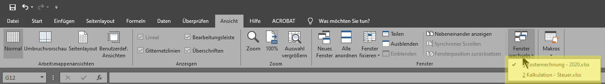
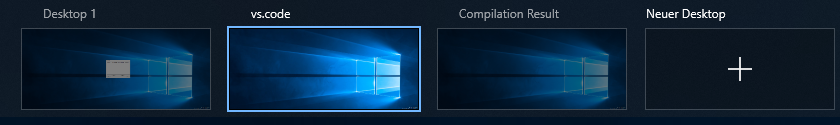
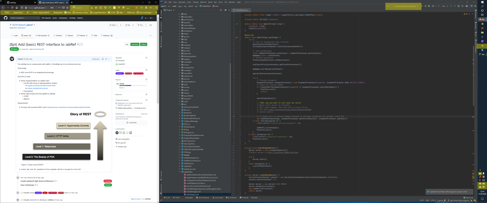
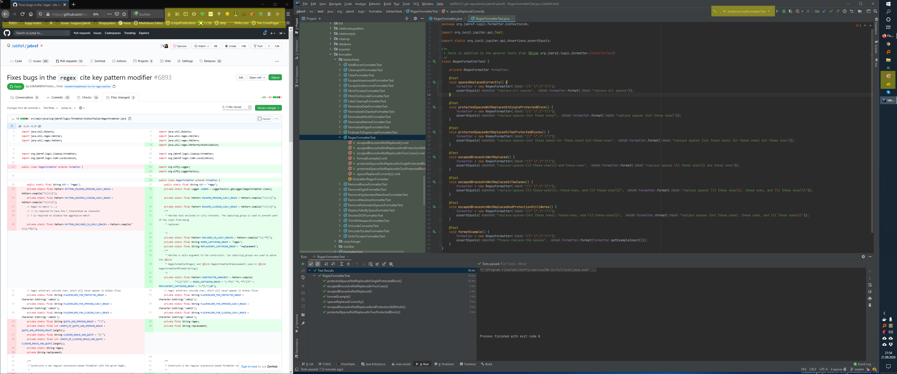

# ContextSwitcher — Background and Vision

**Call for student development** In relation to [ICSE 2021](https://conf.researchr.org/home/icse-2021) in the context of [SCORE 2021](https://conf.researchr.org/home/icse-2021/score-2021) --> <https://conf.researchr.org/home/icse-2021/score-2021#contextswitcher-focus-on-the-thing-to-be-done>

## Motivation

ContextSwitcher is for people who work on many projects at once.
A project is anything that takes more than one step to finish — "buy Acme Brick Co.", "write the thesis", "plan the 2025 holiday".
David Allen [observes](https://gettingthingsdone.com/2011/01/the-6-horizons-of-focus/) that most people have between 30 and 100 of them open at any time.

Every project has its own working set: certain applications, certain windows, certain files, each at the position you left it.
That working set only exists on the screen, so switching projects means rebuilding it by hand.

Suppose you are working on a project with IntelliJ, a handful of browser tabs, and a Word document open.
An urgent email arrives and pulls you into another project — one you last left with different browser tabs and a different Word document.
ContextSwitcher restores that state at the press of a key, and puts the previous one back when you return.

In short: ContextSwitcher is a workspace manager that spans all your applications.

## Example Projects, Tasks and Opened Applications

A project might be subdivided into several tasks. These examples show a current task of a project.

* Project "Holiday 2025": Task: “Search for city tours in Leipzig”: Chrome and OneNote (for taking notes)
* Project "Research Agenda 2025": Task: “Collecting information about a topic”: Chrome and JabRef (for storing the bibliography entries)
* Project "Student Project: Implement Software X": “Meeting with students about their project”: Outlook (with all relevant emails), Notepad++ (for meeting minutes), Explorer (showing the project directory), Eclipse (with the current workspace and the linked Mylyn task being active)
* Project "Be MSc in 2021": Task: "Write thesis": Working on a large LaTeX document

In each opened application, only the relevant files (tabs) should be opened.
When switching a project, applications needed in both projects should stay open, no longer needed ones should be closed, and missing ones should be started.
The same applies to files (tabs) in the applications.
If possible, the last focused position (line in Word documents, cell in Excel, slide in PowerPoint) should be restored.

## Comparison to Virtual Desktops

Users use virtual desktops in two ways:

* Each virtual desktop for a context
* Multiple desktops for a single context

When using each virtual desktop for a context, the first context might be "email reading and surfing" and the next one "coding".
For "Thesis writing", a third desktop "LaTeX" needs to be opened.
Thus, one needs n different desktops for n projects.
Alternatively, virtual desktops need to be reused and maybe won't be named properly (e.g., "LaTeX" versus "Desktop 2").

When using multiple desktops for a single context, the current context might be "coding" with the virtual desktops "email reading and surfing" and "coding". When switching to the context "Thesis writing", browser tabs need to be closed and new ones opened, JabRef will be loaded, the "coding" desktop will be renamed to "LaTeX" (containing TeXstudio).

Not all applications fully support Virtual Desktop.
For instance, Microsoft Excel shows opened windows on *all* virtual desktops:



For Skype, when focusing the application on a virtual desktop, the skype app steals the focus on its current virtual desktop.

When working on **one** project, possibly, **multiple** virtual desktops are required.
Currently, they have to be renamed for each project manually.

In the following example, they are named "Desktop 1", "vs.code", and "Compilation Result".
The first one is intended for a web browser, the second one for Visual Studio Code, and the final one holds some LaTeX compilation result.
These desktops are required in the latex-template context only, not in a context for searching for a trip, for instance.



## Application Limitations

* Microsoft Office applications show all opened windows in the "Window" drop down. ContextSwitcher will display only relevant Windows for the task (because only these documents are opened)
* Some apps might require multiple profiles

### Unnecessary Icons and IDE Details



The yellow-marked things in the tools are either obsolete in this context (firefox, icons in the task bar) - or wrong (IntelliJ - I don't need this run thing).

### Cross-Application Context Switching Not Working

When reviewing a pull request on GitHub, the IDE should checkout the code and switch to the branch. This doesn't happen.



## Background and Related Work

Moved to [related-work.md](related-work.md).

## Usage Examples

### Context Switching from GitHub Issue 1 to GitHub Issue 5

Context "Add Quick Access Support":

* Firefox:
  * <https://www.mailbox.org>
  * <https://github.com/contextswitcher/contextswitcher-private/issues/1>
* IntelliJ: Branch `add-quick-access-support`
* Windows Explorer shows `C:\temp`

Context "Support Icon Rearranging":

* Firefox:
  * <https://www.mailbox.org>
  * <https://github.com/contextswitcher/contextswitcher-private/issues/5>
* IntelliJ: Branch `add-desktop-rearrange-support`

User is in context "Add Quick Access Support".
User demands switching to "Support Icon Rearranging".
Context Switcher causes following actions:

* Firefox: close tab <https://github.com/contextswitcher/contextswitcher-private/issues/1>
* Firefox: open tab <https://github.com/contextswitcher/contextswitcher-private/issues/5>
* IntelliJ: Switch to branch `add-desktop-rearrange-support`
* Close of Windows Explorer window

### Context Switcher and Virtual Desktops

Suppose switching from A to B:

* Store the number of virtual desktops
* Store the applications (and their position) opened at each virtual desktop
* Store the name of each virtual desktop
* Close all apps
* Change the number of virtual desktops according to B
* Change the names of the virtual desktops according to B
* Position the applications on the virtual desktops according to B

## Goal

In this project, a framework with an UI and ten plugins for task-focused applications on Windows should be implemented.
The main UI should be kept simple:
A list of projects with the possibility to add a new project, remove a project and focus a project.

If possibly, supporting multiple tasks per project is a nice add-on, but not a must.

Following Applications should be supported:

* Windows Virtual Desktop
  * The names of the virtual desktop should change according to the context (e.g., in the context "Working on a large LaTeX document": "vs.code" (having vs.code and git gui) and "compilation result" (showing SumatraPDF)).
* Chrome
  * Not possible using [ChromeDriver](https://sites.google.com/a/chromium.org/chromedriver/downloads), because [just attaching to a running instance isn't technically possible](https://github.com/seleniumhq/selenium-google-code-issue-archive/issues/18#issuecomment-191402419)
  * Or implement own extension based on messaging: <https://github.com/vakho10/Native-Messaging> or <http://git.javadeploy.net/coderrooftrellen/simple-chrome-extension/blob/f4d38c82c7e7cce68c89a5d008a26c7689cfe4fa/Readme.md>
* Firefox
* Word
* Excel
* PowerPoint
* Windows Explorer (with [QTTabBar](http://qttabbar.wikidot.com/) extension)
* Outlook
* Notepad++
* IntelliJ
* Eclipse (with [Mylyn](https://www.eclipse.org/mylyn/) plugin)

## Development Aspects

In the following, development aspects are given.

### Development Phases

The intended development phases for this project are as follows:

1. Skeleton for core module to store context and to switch context ("core")
2. Firefox plugin for getting/setting context in Firefox and in the core
3. Microsoft Word plugin for getting/setting context in Firefox and in the core
4. UI for the core
5. Integrate cool stuff such as [ZEIº](https://timeular.com)

### Implementation

The chosen language to implement “Context Switcher” is free.

Following alternatives should be considered:

* AutoHotkey
* [AutoIt](https://www.autoitscript.com/site/) with [autoitx4java](https://github.com/sixtoad/autoitx4java)
* See also <https://alternativeto.net/software/autoit/>
* Python 3.0
* C#
* Java
  * Reuse code of [Eclipse Jubula](https://www.eclipse.org/jubula/)

It might be required to write a plugin foreach supported application.

### How to Implement Context Switching

#### Option 1: Plugins for Each Supported App

Assumption: Three hard-coded context names "Context A", "Context B", "Context C"

ContextSwitcher freshly started.
Opened applications:

* Notepad++
* Word

They register at ContextSwitcher

```text
Notepad++ --> ContextSwitcher: {"appid": "Notepad++", "state": "started"}
Word --> ContextSwitcher: {"appid": "Word", "state": "started"}
```

* Notepad++: User opens `c:\temp\test.txt`
* Word User opens `c:\temp\test.docx`

ContextSwitcher: User clicks on "Save to Context A".

```text
ContextSwitcher -> Notepad++: {"appid": "Notepad++", "command": "SaveContext"}
ContextSwitcher -> Word: { "appid": "Word", "command": "SaveContext"}
```

```text
Word -> ContextSwitcher: {"appid": "Word", "state" : { "files": ["c:\temp\test.docx"] } }
Notepad++ -> ContextSwitcher: {"appid": " Notepad++", "state" : { "files": ["c:\temp\test.txt"] } }
```

Now, ContextSwitcher can save the JSONs.

User closes Word, Notepad++ and ContextSwitcher

User starts Word, Notepad++ and ContextSwitcher

```text
Notepad++ --> ContextSwitcher: {"appid": "Notepad++", "state": "started"}
Word --> ContextSwitcher: {"appid": "Word", "state": "started"}
```

User clicks on "start Context A" in ContextSwitcher.

```text
ContextSwitcher  -> Word: {"appid": "Word", "state" : { "files": ["c:\temp\test.docx"] } }
ContextSwitcher  -> Notepad++ {"appid": " Notepad++", "state" : { "files": ["c:\temp\test.txt"] } }
```

See that the same JSON is sent back to Word and Notepad++ as it was received? No need for custom plugins.

The custom plugin would be needed to start the application out of a context. - For that, I would just have a configuration json

```json
{
  "Notepad++": {
    "startCommand": "C:\\Program Files\\Notepad++\\notepad++.exe"
  },
  "Word": {
    "startCommand": "C:\\Program Files\\Microsoft Office\\root\\Office16\\WINWORD.EXE"}
  }
}
```

Word offers writing plugins using JavaScript. See <https://docs.microsoft.com/en-us/office/dev/add-ins/develop/understanding-the-javascript-api-for-office>.
The manifest allows to specify domains to open. See <https://docs.microsoft.com/en-us/office/dev/add-ins/develop/add-in-manifests?tabs=tabid-1#specify-domains-you-want-to-open-in-the-add-in-window>.

The "only" thing left is the communication between the apps.
Read on at "How to Communicate between the Apps and Context Switcher?"

#### Option 2: ContextSwitcher Controls Application

ContextSwitcher has dedicated plugins for each supported applications.
It controls the applications by sending keyboard presses and tries to read the window through the Windows API.

Here, frameworks such as [FlaUI](https://github.com/FlaUI/FlaUI) (C#) could be used.
See https://github.com/FlaUI/FlaUI/wiki/FAQ for discussions on the powers on FlaUI.

When using the tool [Snipaste](https://www.snipaste.com/), one can see how good UI element detection by an external application can work.

### How to Communicate between the Apps and Context Switcher?

Follow-up to "How to Implement Context Switching", Option 1.

#### Context and Problem Statement

When crafting a plugin for each supported application, each plugin has to communicate to Context Switcher and receive commands from Context Switcher.

#### Discussion on Options

As general pattern, "messaging" should be used.
Maybe, each application creates a queue to ContextSwitcher and a call-back queue (see <https://www.rabbitmq.com/tutorials/tutorial-six-python.html> for details). The mentioned "temporary" queue is kept open as long as the application runs. It receives the commands from ContextSwitcher.

Example implementation is [RabbitMQ](https://www.rabbitmq.com/download.html)? There is a .net client library.
(I am not sure about the [channel concept](https://www.rabbitmq.com/channels.html))

There is [Microsoft Message Queueing](https://en.wikipedia.org/wiki/Microsoft_Message_Queuing). It can be installed (and removed) on Windows 10 easily. See <https://superuser.com/a/986399/138868>.

Possibly, it is easier to host a http endpoint, where each application registers.
Then, the server can send commands to the client using [Server-Sent Events](https://www.w3schools.com/html/html5_serversentevents.asp).
For instance, ContextSwitcher sends "save state". Then, the application PUTs its new state to ContextSwitcher.
After all registered applications did this, ContextSwitcher can continue.

~~Chrome Extensions can only communicate to the outside using [Native Messaging](https://developer.mozilla.org/en-US/docs/Mozilla/Add-ons/WebExtensions/Native_messaging). The application reads from `stdin` and writes to `stdout` to communicate with the extension.~~
Superseded 2026-09-10: an MV3 service worker opens a loopback WebSocket like any other page, which is what both extensions do (MADR 0004, MADR 0030).
This is a solution to communicate with the Context Switcher browser extension.
For each extension (Chrome, Firefox), one instance of the "Native Messaging Host" (the Context Switcher part) is started.

<!-- markdownlint-disable-file MD026 -->
